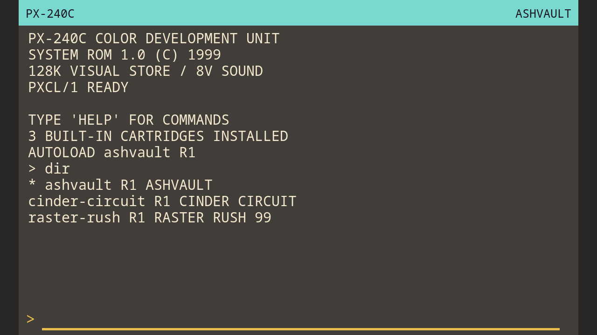
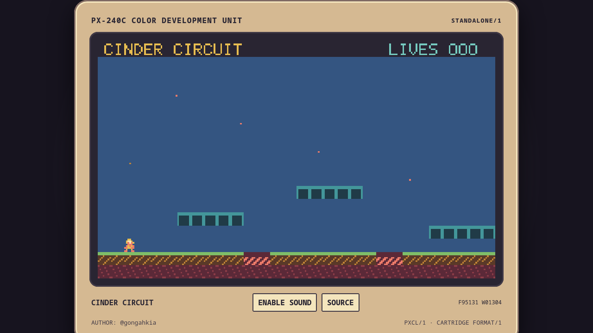
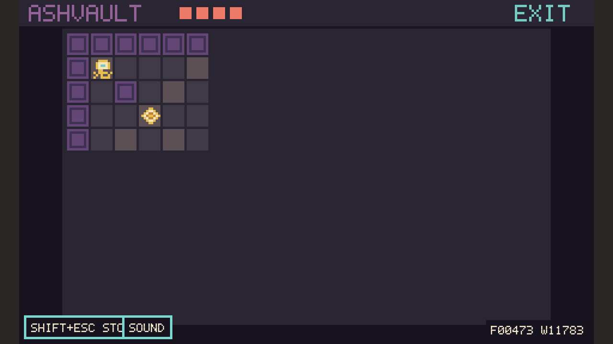
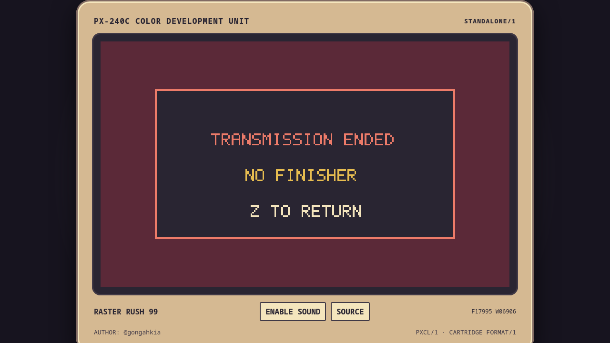

# PX-240C Color Development Unit

PX-240C is a complete local-first fantasy console presented as a technically unusual, commercially
unsuccessful colour handheld from 1999. Its alpha includes the statically typed PXCL/1 language,
Rust/Wasm compiler, deterministic worker runtime, 240x144 integrated Studio, source debugger and
rewind, native Linux CLI/LSP, reproducible cartridges, shared headless/offline standalone execution, and three original
pack-in games.

Made by @gongahkia. Copyright 2026 @gongahkia. All rights reserved. This repository is private and
proprietary; cartridge authors retain ownership of their source and assets.



## Alpha status

The cohesive alpha workflow is implemented: create/import a cartridge, edit code and source-visible
assets, compile, run, debug, rewind, save/recover, pack, inspect, and export without an account or
backend. The production app is a relative-path static PWA and works offline after its first
successful load. Compiler/runtime rules, measurements, known limitations, and milestone evidence
are in [`docs/`](docs/PROGRESS.md).

The original bundled cartridges are ordinary public-facility PXCL projects:

| Game                                        | Focus                                                                               |
| ------------------------------------------- | ----------------------------------------------------------------------------------- |
| [Cinder Circuit](cartridges/cinder-circuit) | Responsive tile platforming, animation, tasks, camera, and SFX                      |
| [Ashvault](cartridges/ashvault)             | Procedural fog-of-war roguelike, records/lists, enemies, and isolated save progress |
| [Raster Rush 99](cartridges/raster-rush)    | Scanline pseudo-3D racing, synth music, and simultaneous 2-4 player split screen    |





## Quick start

Requirements are Linux, Node.js 22.22 or newer, pnpm 10.32.1, and Rust 1.98 with Clippy, rustfmt,
and `wasm32-unknown-unknown`. The one setup command installs locked dependencies, installs the pinned
`wasm-bindgen-cli` 0.2.128 when absent, installs the pinned Playwright Firefox test browser, and
builds the complete project:

```sh
make setup
pnpm dev
```

Open the printed local URL. The monitor shell starts with all three cartridges installed. Use `dir`,
`load raster-rush`, and `run`; Shift+Escape stops a game. `help` lists integrated commands. Keyboard
port one uses arrows plus Z/X/A/S, while standard gamepads populate all four ports.

Run every repository gate with:

```sh
make check
```

This includes the production build and the pinned Firefox end-to-end workflow.

For the native external-editor workflow:

```sh
cargo run -p px240c-cli -- new my-game --title "MY GAME"
cargo run -p px240c-cli -- check my-game
cargo run -p px240c-cli -- test my-game
cargo run -p px240c-cli -- run my-game
cargo run -p px240c-cli -- run my-game --headless --frames 120 --input path/to/replay.json
cargo run -p px240c-cli -- export html my-game
```

See the [from-scratch tutorial](docs/TUTORIAL.md), [tool guide](docs/TOOLS.md),
[PXCL language contract](docs/LANGUAGE.md), and [cartridge format](docs/CARTRIDGE_FORMAT.md).

## Boundaries

This alpha has no cloud account, synchronization, hosted backend, gallery, network/multiplayer API,
desktop GUI, third-party cartridge compatibility, raw JavaScript escape, true-colour path, samples,
physics engine, ECS, scene graph, or real 3D renderer. Worker containment is a practical browser
boundary, not process-level isolation; [SECURITY.md](docs/SECURITY.md) states the exact limits.

To refresh documentation screenshots, build and serve `dist/studio`, then use any browser capture at
an exact integer viewport scale. The checked images above were captured from Firefox at 5x with the
Playwright CLI; no mockups are used.
